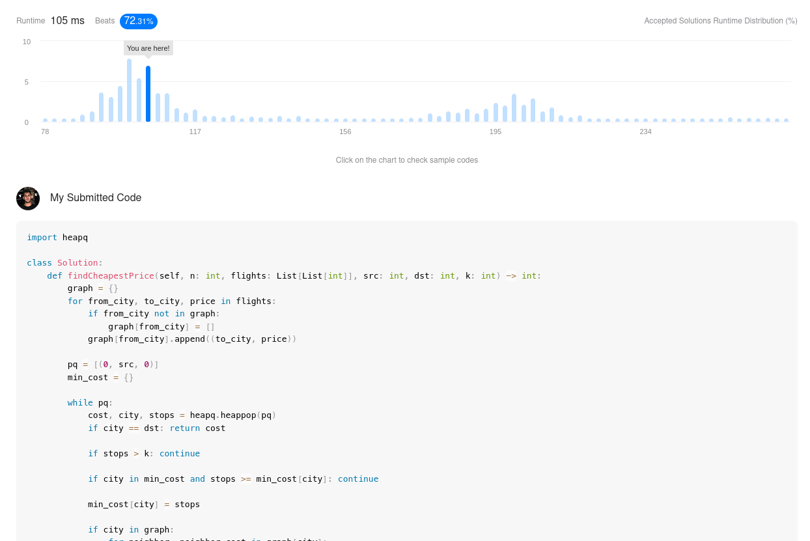

# Exercicios Resolvidos

**Número da Lista**: 2 
**Conteúdo da Disciplina**: Grafos 2 

## Alunos
|Matrícula | Aluno |
| -- | -- |
| 19/0103302  |  Bernardo Chaves Pissutti |

## Sobre 
Os exercicios resolvidos neste projeto foram escolhidos pensando em abranger todo o conteúdo ensinado nas aulas de Grafos 2. Os conteúdos abordados foram:
* Dijkstra
* Prim
* Kruskal
* Union-find

## Screenshots

## Instalação 
**Linguagem**: xxxxxx 
**Framework**: (caso exista) 
Descreva os pré-requisitos para rodar o seu projeto e os comandos necessários.

## Uso 
Explique como usar seu projeto caso haja algum passo a passo após o comando de execução.

## Outros 
Quaisquer outras informações sobre seu projeto podem ser descritas abaixo.

