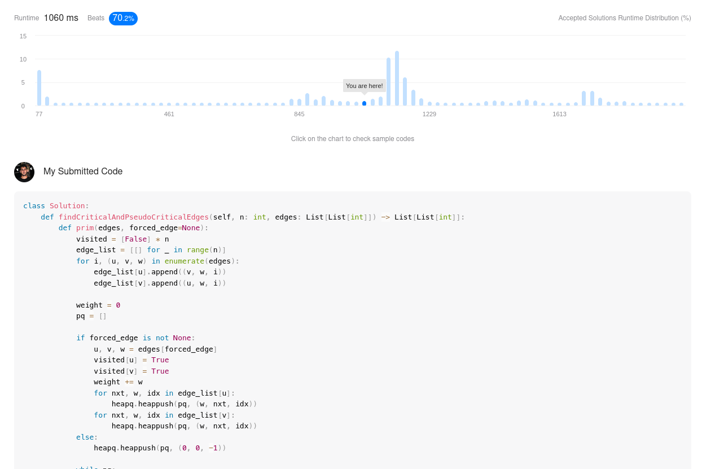
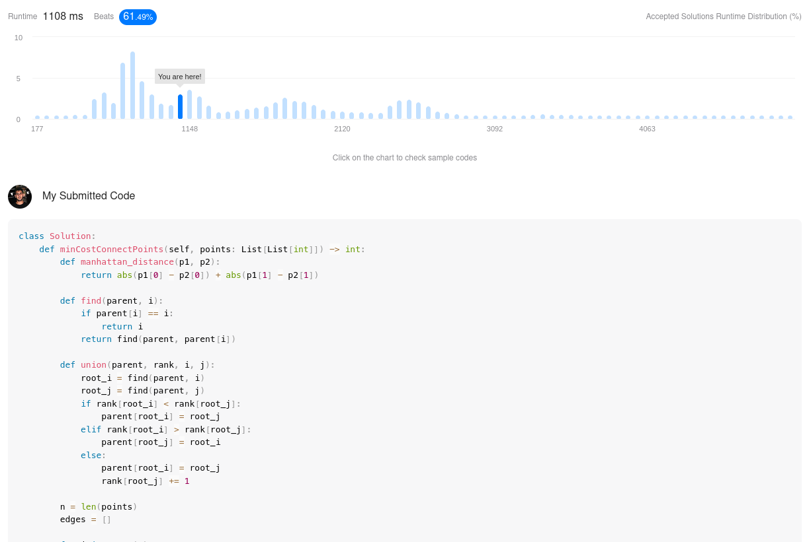

# Exercicios Resolvidos

**Número da Lista**: 2 
**Conteúdo da Disciplina**: Grafos 2 

## Alunos
|Matrícula | Aluno |
| -- | -- |
| 19/0103302  |  Bernardo Chaves Pissutti |

## Sobre 
Os exercicios resolvidos neste projeto foram escolhidos pensando em abranger todo o conteúdo ensinado nas aulas de Grafos 2. Os conteúdos abordados foram:
* Dijkstra
* Prim
* Kruskal

## Screenshots

## Instalação 
**Linguagem**: Python3 
O único requisito para executar os scripts é ter o python3.

## Uso 
Ne trabalho foram resolvidos execicios do [leetcode](https://leetcode.com/). Para avaliar o código o avaliador pode, tanto executar o código na propria máquina, quanto abrir o exercicio relativo ao código à ser corrigido e testa-lo na própria plataforma do leetcode, o link para cada exercicio está disponível no seu respectivo readme.

## Vídeo

O vídeo está na pasta assets/video/

